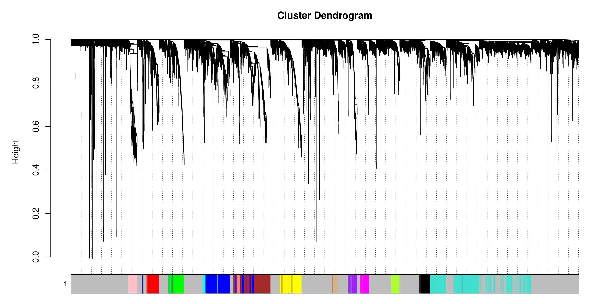
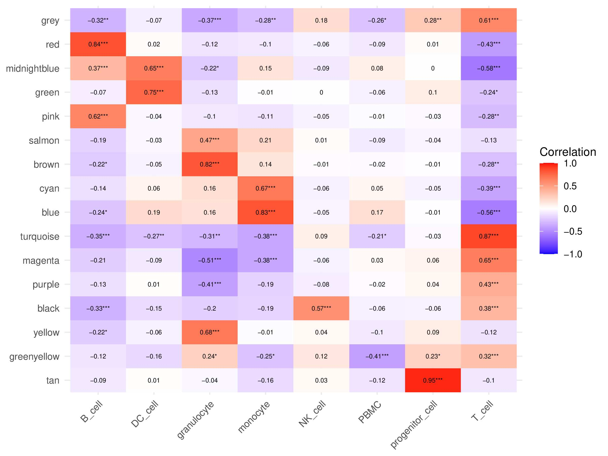
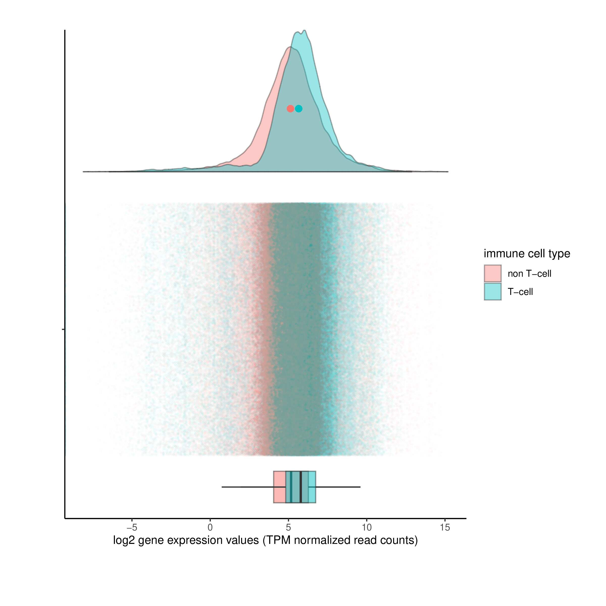
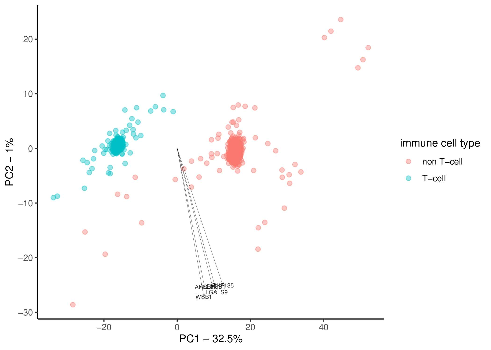
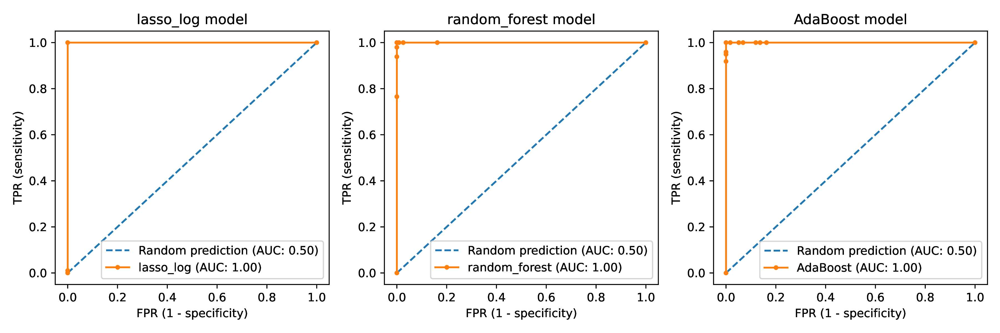

# Gene Discovery with Machine Learning Classifiers of Immune T-cells

## Introduction
Transcriptome data typically result in large datasets containing tens of thousands of genes. The goal of analyzing transcriptome datasets are too find
a subset of genes with expression modulations that contribute to physiological change in the model organism. One such approach is gene differential
expression analysis, which uses linear regression models on each gene to identify changes in expression between biological conditions. These models
are created with the gene read counts as the dependent variable and biological condition as the independent variable. However, this approach is
overreliant on the p-value to determine if a gene is differentially expressed and suffers when biological variability is high resulting in few genes
being identified. In addition, this is computationally intensive because a model must be fit for every individual gene.

I suggest an alternative approach to identifying a subset of biological relevant genes that utilizes machine learning methods. This approach instead
fits a single machine learning model using the biological condition/trait as the dependent variable (aka, target variable in machine learning speak) and
takes each gene and its read counts as the independent variables (aka, feature variables). The goal of this approach is to use the transcriptome
data to make predictions/classifications on the biological trait. This uses machine learning models such as LASSO regression and ensemble methods
that inherently filter out feature variables not contributing to the prediction/classification. The resulting models will contain features/genes
that can be extracted resulting in a subset of genes significantly contributing to a biological condition.

## Dataset
To demonstrate this approach, I will be using a dataset obtained from the *National Library of Medicine (NCBI) Gene Expression Omnibus (GEO) database*
([Accession number: GSE107011](https://www.ncbi.nlm.nih.gov/geo/query/acc.cgi?acc=GSE107011)) under an
[open-license](https://www.ncbi.nlm.nih.gov/geo/info/disclaimer.html) with no copyright restrictions. The data was generated by
[Monaco et al., 2019](https://www.cell.com/cellreports/fulltext/S2211-1247(19)30059-2?_returnURL=https%3A%2F%2Flinkinghub.elsevier.com%2Fretrieve%2Fpii%2FS2211124719300592%3Fshowall%3Dtrue#secsectitle0135)
for their paper entitled “RNA-Seq Signatures Normalized by mRNA Abundance Allow Absolute Deconvolution of Human Immune Cell Types”.

The transcriptome data contains TPM (Transcripts Per Million) normalized read counts for 127 total samples from 8 different immune cell types in 13
healthy Singaporean individuals. Cell types include B/T cells, Dendiritic Cells (DC), Natural Killer (NK) cells, granulocytes, monocytes, progenitor
cells, and Peripheral Blood Mononuclear Cells (PBMCs). To simplify predictions/classifications, I have grouped these samples into two immune types:
T-cells (58 samples) and non T-cells (69 samples).

## Pipeline of Analysis
There are two main portions to this pipeline:

1. Gene module creation with WGCNA
2. Machine learning classifiers

### 1. WGCNA
This portion of the pipeline attempts to create an initial subset of genes that are associated with the trait or biological condition of interest
(in this case T-cells). It does this through creating modules/clusters of genes using
[WGCNA](https://bmcbioinformatics.biomedcentral.com/articles/10.1186/1471-2105-9-559) and correlates them to the trait of interest. Hub genes from
these identified gene modules are then extracted as features to be used in the machine learning models.

### 2. Machine Learning
Various machine learning models including **LASSO logistic regression**, **random forest classifier**, and **adaptive boost classifier** are trained and tested
to obtain the final subset of genes that are significantly contributing to the prediction/classification of T-cells. This subset of genes can be further
analyzed for their biological functions using various enrichment analyses.

The figure below provides an overall summary of how the scripts were used along with their data inputs and outputs.

## Results
The initial transcriptome dataset contained read counts **58,174 genes**. After filtering out genes with low read counts (ie. genes with an average TPM
less than 10), this resulted in **10,247 genes** to be used in WGCNA.

### 1. WGCNA
WGCNA clustered the 10,247 genes into **16 different modules** as shown by the dendrogram.

Of these 16 gene modules, **10** of them significantly correlated (FDR adjusted p-value < 0.001) with the trait of interest (T-cells).

From these 10 modules, 826 genes were identified as hub genes and used as the feature variables for the machine learning models.

### 2. Machine Learning
#### Data distribution
The distribution of TPM read counts for these **826 genes** show overlapping but distinct distributions between T-cell and non T-cell samples.

This difference in distributions between immune cell types is further highlighted when plotting the data using the first two principal components (PCs).

#### Model Training
1. The **LASSO logistic regression model** resulted in **86 features/genes** being used to make T-cell predictions.
2. The **random forest classifier model** resulted in **114 features/genes being** used to make T-cell predictions.
3. The **adaptive boost classifier model** resulted in **6 features/genes** being used to make T-cell predictions.

#### Model Testing
Model testing reveals **100% classification** accuracy for each model when predicting the immune cell type of an RNA-seq sample. These results are shown
by the confusion matrices for each model.

Additionally, the Area Under Curve (AUC) scores for ROC curves of each model are 1, indicating perfect classification performance. Specifically,
each model is able to perfectly distinguish between T-cell and non T-cells without any errors given our testing dataset.

#### Model Decision Boundaries
Plotting the first two principal components of the testing data along with the decision boundary for each model highlights the accuracy of each models
predictive capabilities.

## Conclusion
The three machine learning models LASSO logistic regression, random forest classifier, and adaptive boost classifier used **86**, **114**, and **6 genes**
respectively to make their classifications of immune T-cells. This resulted in a subset of **162 unique genes** that can be used in downstream analyses
to enrich their biological functions. This will provide insights into genes that significantly contribute to the gene expression modulations that
determine a T-cell.
